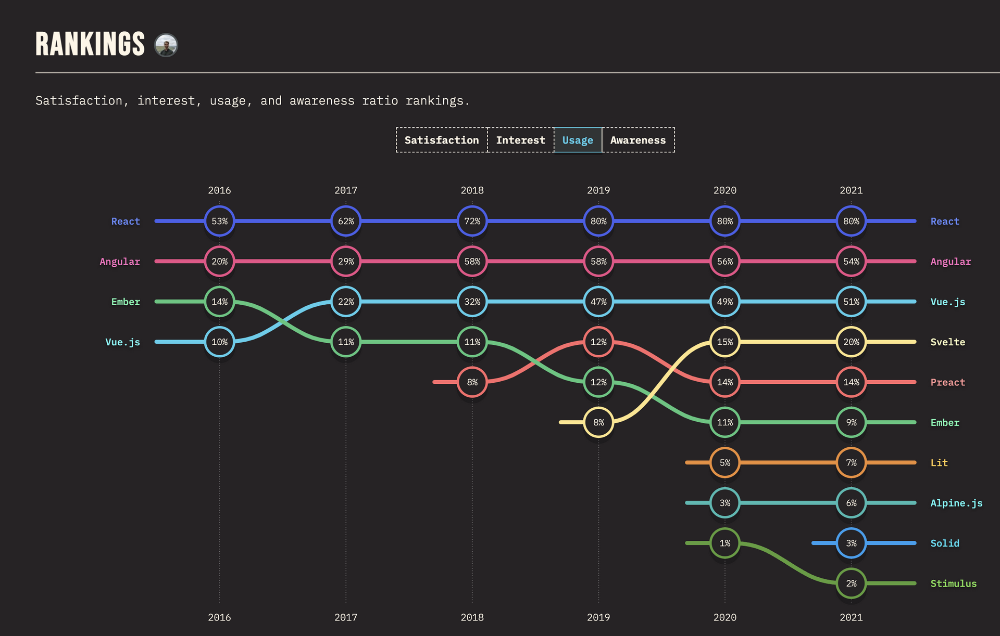

# Part 1. React: Introduction ℹ️

## 1. So... What is React? 🤔

* React.js
* Referred to as a JS framework,  actually JS library ☝️ 
* Created by Facebook SW Engineer, Jordan Walke. :p
* A tool for building UI components 🧰
* Used for Single-Page Applications 
* Current version v.18.0.0. (pr. Mai 2022)
* First used in Facebook Newsfeed feature anno 2011
* Allows for reausable UI Components
* [Frontend frameworks Trends](https://2021.stateofjs.com/en-US/libraries/front-end-frameworks/)

How many use it? 

How many like it? 

* * *


## 2. What is a JS framework (vs library)? 🧰
* Scenario: House
	* **Framework** = Buy a new house ready built - you just work with what is made. 🏠️
	* **Library** = Build a house from sratch, you can choose everything; floor plan, architecture etc. 🏗️
* **TLDR**; You tell libraries what to do, frameworks tell you what top do!
* **Frameworks:**
	* 👍️  Ready to go with best practices to follow - easier to folllow a common standard
	* 👎️  Can overcomplicate things, be slower, long loading time and lots to learn
	
* **Libaries:**
	* 👍️  You tailor the app based what you/your team wants and needs - you have the choice and full control
	* 👎️  Easier to make bad decisions and ruin your application
	
 
 
 
 
 * In the end; "The job determines the tool" - Me  👴
* * *

## 3.  *Something nice to know:* Basic Terminology 🟡
* DOM = Document Object Model. 
	* When a web page is loaded, the browser creates a **D**ocument **O**bject **M**odel of the page
	* Simply put; a tree structure of objects of the page
	* A web page is basically a document (HTML). its representation in the DOM allows it to be *manipulated*. 
	* Respresents a *document* with a logical tree of *nodes*. Each branch ends in a node and node contains *objects*.  
	* JS can access and change all the elements of an HTML DOM
	* You have: 
		* CORE DOM = all doc types, XML DOM = XML docs and HTML DOM = HTML docs
	* In short: A standard for how to get, change, add, or delete HTML elements. 
		* `document.getElementById(id)`
		* `element.setAttribute(attribute, value)`
		* `document.createElement(element)`
		* `document.getElementById(id).onClick = function(){code}`

 

* JSX
	* Javascript XML - allows us to write HTML in React
	* Easier to write and read HTML in React
	* Example: 
		* `const myElement = <h1>I a made using JSX!</h1>;`
		* `const myElement = React.createElement('h1', {}, 'I am too cool for JSX!');`
	* One little catch ⚠️
		* `class` attribute is widely used in HTML => JSX is rendered JS. 
		* `class` as a keyword is reserved in JS e.g. `class MyClass` etc.
		* `class` => `className` in JSX
		* `const myElement = <h1 className="myclass">Hello World</h1>;`
* ES6 - ECMAScript 6
	* Standard for Javascript - 6th version of ECMAScript. Published in 2015
	* Some notable features: 
		* Variables = `let, const, var`
		* Arrow functions = function notation `let myFunc = () => {};`
		* Array methods = `.map(), .join(), .pop(), .push()` etc
		* Ternary operator = `isSomethingTrue ? yes : no`
		* Spread operator = `var1, var2, ...the-rest-here`
* CDN - Content Delivery Network
	* Group of servers spread across many locations
	* Make for a fast service less affected by hight trafic - low latency
	* In Web; used for delivering stylesheets and javascript files (static assets) og libraries like *Bootsrap, JQuery, React etc* over links
	* Many advantages; 
		* Less burden on own servers
		* They potentially can be closer to users than own servers
		* Pre-configured with proper cache settings; i.e. no need to configure static assets on own server
	```
	<script src="https://code.jquery.com/jquery-3.6.0.min.js" integrity="sha256-/xUj+3OJU5yExlq6GSYGSHk7tPXikynS7ogEvDej/m4=" crossorigin="anonymous"></script>
  ```


* * *
## 4. Why React? What makes it special?❓️

* It creates a virtual DOM in memory
* Virtual DOM =  Blueprint of the actual DOM. 
	* React; `React.div` => `div`, `React.ul` => `ul` etc
* Makes it easily to make changes - its in memory
* Make changes in a "vurtual" DOM > Manipulate the browsers DOM directly
* React changes only what needs to be changed - Hence "Reactive"
* React work likes this.. "What needs to be changed?" "OK, I will only change that!"
* Easily testable, good library support and control of tests monitoring
* * *

## 5. 🟢  *Something we need to know*: React Building Blocks. 🧱 
* **SPA = Single Page Application** 
	* Default method is to load new pages (in this case: views) entirely, but SPA takes new data from the webserver by interacting with the page and refreshing the current web page.
	* The app is loaded from one page, and when interacting with the page the necessary elements are simply loaded - not a a full app reload. 

 


* Components
	* 	Independent and reusable bits of code. An entity of its own. Car, House, Person, Book, etc etc.
	* 	Work in isolation and can be either "Class" or "Function" Components
	* 	Note: In Reac; always start component names with a capital letter. `MyComponent, Header, ComponentWithVeryLongName`


```js
import React, { Component } from "react";

class Header extens Component { 
	render() {
		return <h1> Title <h1/>
	}
} 
```
* **Class components**
	* Before React v.16.8 this was the only way to create Componets with state lifecycle events
	* React Hooks have made Class Components less favorible. 
	* You can achiece the same, with less code. 
	* They are still maintained so *can* be used, but beware, most prefer FC instead
	* 👍️  Come with built-in state (i.e. `this.state = {isLoading: true}`) 
	* 👎️  Write more code to achieve the same as Function Components; more complex and less readable in comparison. 
```js
// ES6
import React from "react";
const Header = () => { return <h1> Title </h1> }
```` 
```js
import React from "react";
function Header() { return <h1> Title </h1> }
```` 


 * **Function Components**
	* Essentially like Class functions just written as functions; written with less code, easier to understand. 
	* React itself recommends using FC and if state and lifecycle methods are needed; use Hooks. 
	* 👍️  Faster, easier and cleaner in terms of developing, understanding and testing the code. 
	* 👎️  Nothing really negative, but some may have other opinions.. 😒
* **Props**
	* Basically "properties"or object arguments used for passing data between components. 
	* Think Garage and Car as two components, a "prop" that can be sent from Garage to Car is `brand/model, registration, electric charging or fossil fueled` etc. 
```js
//./FirstComponent.jsx
<GreetComponent name={"Ola"}/>
```

with Desctructuring: 
```js
//GreetComponent.jsx - Destructuring
const GreetComponent = ({name}) => {
	return <h1> Hola, {name}! </h1>
}
```
 without Destructuring: 
```js
//GreetComponent.jsx
const GreetComponent = (props) => {
	return <h1> Hola, {props.name}! </h1>
}
```

* **Events**
	* Just like HTML events; allow us to person actions based on user "events"or interactions 🖱️
	* Events like; click = `onClick`, mouseover = `onHover`, change = `onChange` etc
	* So we can e.g. `<button onClick={sendMessage}>Sup, you clicked me!</button>`
	* `onClick={sendMessage}` > `onClick="sendMessage()"`
```
const GetTriggered() {
  const shotsFired = (a) => {
    alert(a);
  }

  return (
    <button onClick={() => shotsFired("Yo!")}>Fire shots!</button>
  );
}
```
* **Conditional**
	* React lets you render componets conditionally think `if()` statements
	* Given two FC: 
```js
const MoneyBroke = () => {
	return <h1>No money..<h2/>
}
	
const MoneyRich = () => {
	return <h1>Chaa-ching!<h2/>
}

```
	
* Method #1: `if()` statement
	
```js
const BorrowMoney = ({ gotMoney }) => {

	if (gotMoney) {
		return <MoneyRich />
	}
	return <MoneyBroke />
}
```

* Method #2: Logical `&&` Operator

```js
const BorrowMoney = ({ gotMoney }) => {
	{ gotMoney &&
		return <MoneyRich />
	}
}
```

* Method #3: Ternary Operator  `condition ? true : false`

```js
const BorrowMoney = ({ gotMoney }) => {
	return (
		{ gotMoney ? <MoneyRich/> : <MoneyBroke/>}
	); 
}
```

* **Lifecycle methods**
	* Methods for React to incite action when; a component is mounted, is unmounted, about to be updated etc. 
		* On mounting: `componentDidMount()`
		* On umounting:  `componentWillUnmount()`
	* But then came "Hooks"...
* React Hooks or Lifecycle Hooks 
	* Hooks allow us to "hook" in React features like state and lifecycle methods
	* This makes Class Functions redudant, since it was the big advantage for them
	* Hooks must be imported; e.g.  `import { useState } from 'react'`
	* Rules;
		* Can only be called inside function components
		* Can only be called on the top level of a component
		* Cannot be condtional
	* `useState`
		* Allows to track state in FC
		* State = data or props that need to be tracked in an app
		* Needs (1) inital state and (2) a function to update the state; `cosnt [color, setColor] = useState("")` with (3) argument as the initial state
		* So can also be `cosnt [color, setColor] = useState("red")` 
		* You cannot update state directly, only using the defined function so no this; `color = yellow` ⛔️
	* `useEffect` for performing sideeffects
		* E.g. fetching data, directly updating the DOM, timers etc.

```js
// Examples for Car

const [brand, setBrand] = useState("Ford");
const [model, setModel] = useState("Mustang");
const [year, setYear] = useState("1964");
const [color, setColor] = useState("red");

```
* * *