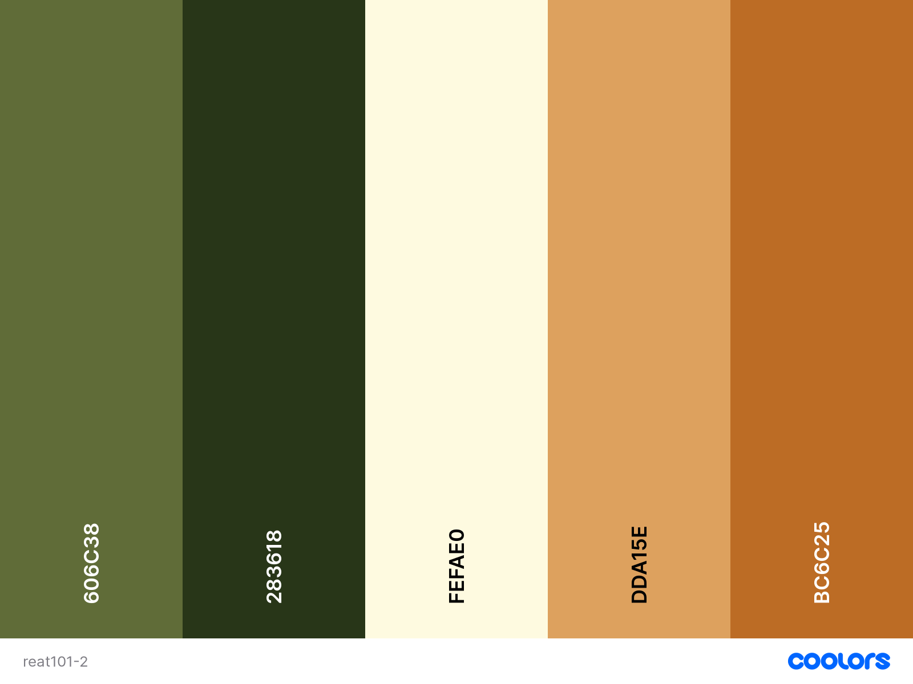
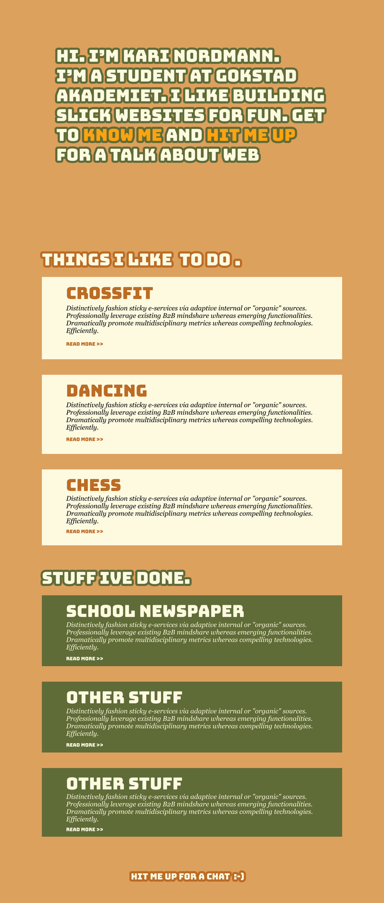

# Part 3: React: Getting our hands dirty 🛠️
*** 

## 1. 🟢 Something we need to know: Styling stuff 🎨
* Sass = CSS preprocessor -which is basically a scripting language that extends CSS and complies to regular CSS
	* 3 syntaxes = Sass (`.sass`), SCSS (`.scss`) aka "Sassy CSS" and Less (`.less`)
	* SCSS is one of two syntaxes for Sass but easier to learn
	* Less = uses javascript (i.e. `@var`)
	* Sass = uses Ruby (i.e. `$var`)
	* **WHY?**  - easier to read, easier to scale, reuse and gives more options and resources. 
* Class = Self declared name for one or more HTML elements
* Selector = points to the HTML element or id or class
* Decalation = Set of CSS property and value
* Declaration Block = A block containing one or more declarations

```css
p {
	font-size: 12px; 
	color: black
}
```


* * *
## Exercise 1: Plan the app 💡 

Given this as a first sketch/wireframe for your application. Perform the following tasks: 


*Excersise 2.1:* 
* Draw boxes/cirles around **possible** elements in the SPA

*Excersise 2.2:* 
* Set each element a given HTML tag (e.g. `<h1>` etc etc) and write it on the boxes

*Excersise 2.3:* 
* Find a cool slick font that you like [here](https://fonts.google.com/)
* Alternative: use one you have/find from other sites if you wish. 

Save the link or have it ready for the next excersise. 

*Excersise 2.4:* 
* Select a color palette [here](https://coolors.co/palettes/trending) or create your own unique color palette [here](https://coolors.co/generate). 

Export the palette in any way you want (as long as you have access to the HEX values .e.g. `#cfcfcfc` etc)

*Excersise 2.5:* 
* Create a new project using the previous commands and call it something nice and sweet like  `my-first-webpage`

```shell
$ npx create-react-app my-first-webpage
$ cd my-first-webpage
```

*Excersise 2.5:* (**Optional!**) 
* Structure your project nice and clean for the creating an app!

* * *
## Exercise 2:  Lets make an App! 🚧

**Prerequisites:** 

0. Take a look at the design [here](https://www.figma.com/file/t1B7r0A6JlPFITIiyoxRVZ/React-Intro---Sketch?node-id=0%3A1) and the easier-to-implement [alternative](https://www.figma.com/file/t1B7r0A6JlPFITIiyoxRVZ/React-Intro---Sketch?node-id=1%3A11)


2. Have you chosen a font?
[Bungee Google fonts](https://fonts.google.com/specimen/Bungee#standard-styles)


2. Have you chosen a palette? 



Excersise 3.1. Create a React app from the following design: 



## Exercise 2B:  Look Ma, I made an App! 💝

Bonus/Exersise 2B. Deploy the app to Github Pages. (Advanced++)

[Follow this simple guide to deploy your APP](https://docs.github.com/en/pages/quickstart)
[Anothe good alternative](https://github.com/gitname/react-gh-pages)

## 3. React on choosing tools 🧰
* Are you still learning React? Creating a single-page app? use `create-react-app`
* Are you building a server-rendered website with Node.js, use `Next.js`
* Are you building a static content-oriented website, try `Gatsby`
* Are you building a component library/integrating with an existing codebase (legacy), well find God.. No, not really but find suitable flexible toolchains. 

## 4. What now? Where to go from here? 🎓️
* Keep on playing around with React - finish your app
* "Sharpen your sword" - find good sources to learn from!
* Create hobby projects
* Pay attention to trends - what's hot or not!
* Gain professional experience - internships/part-time/mentorships
* Just be willing to learn!
* There are more frameworks/libraries etc - Try them out!
* The community is huge - use it!